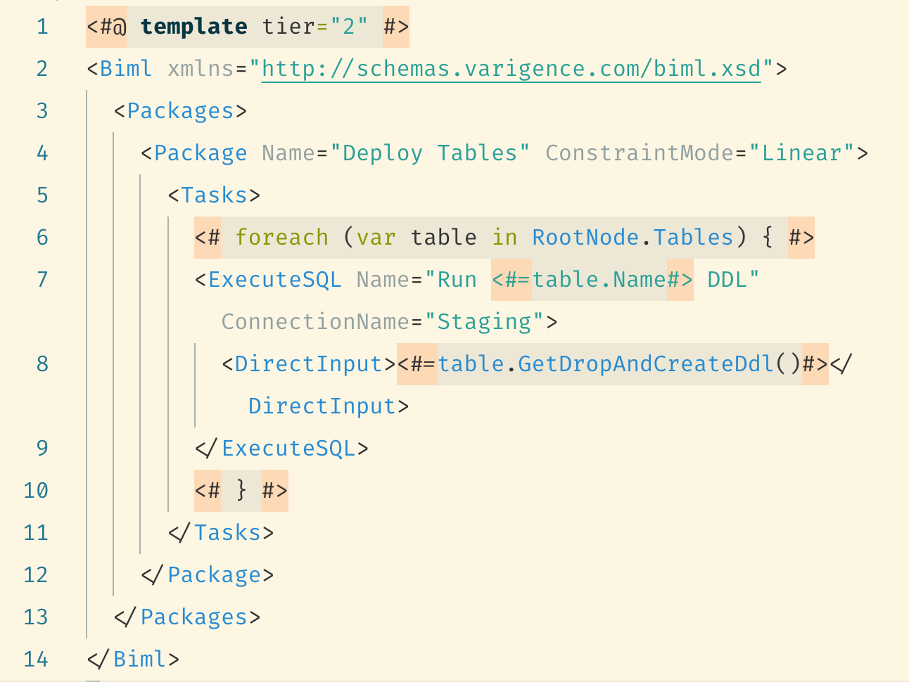

# Biml Support

Very basic language support for Business Intelligence Markup Language (.biml) files.

## Features

Provides syntax highlighting for the Business Intelligence Markup Language.

## Known Issues

Currently only `C#` embedded highlighting is supported.

## Release Notes

### 1.0.0

Initial release.
